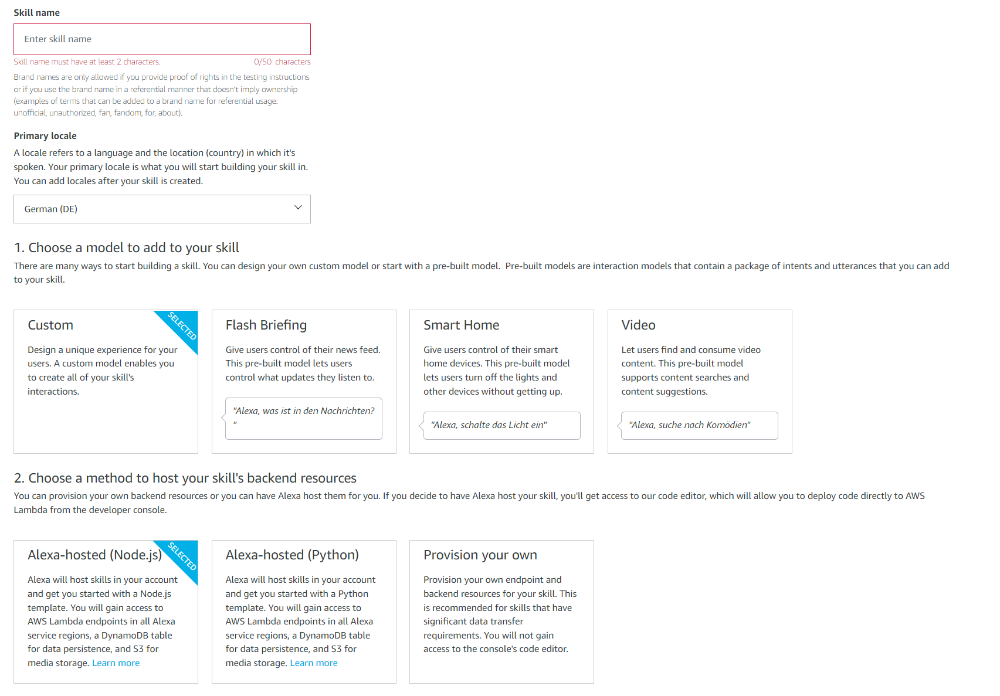
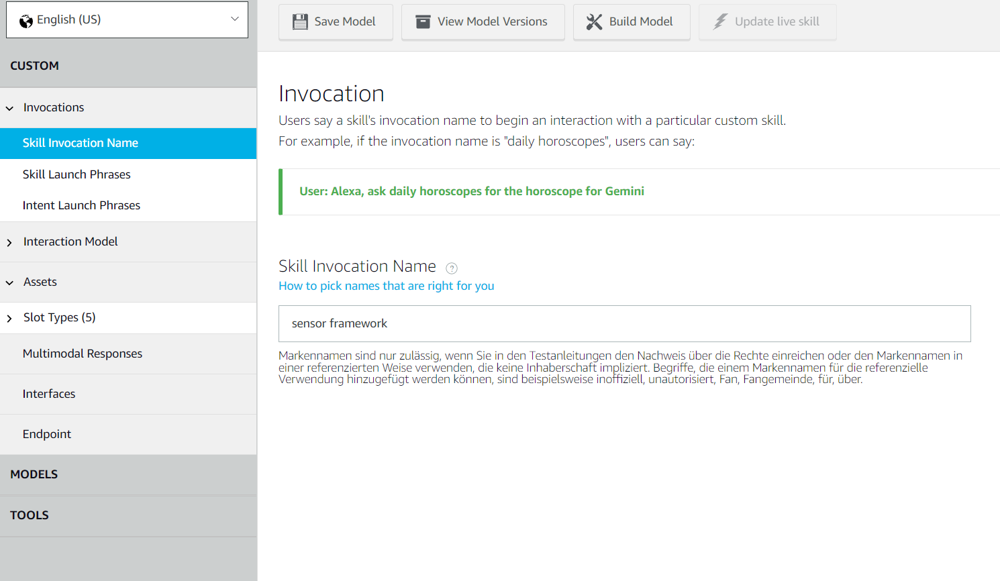
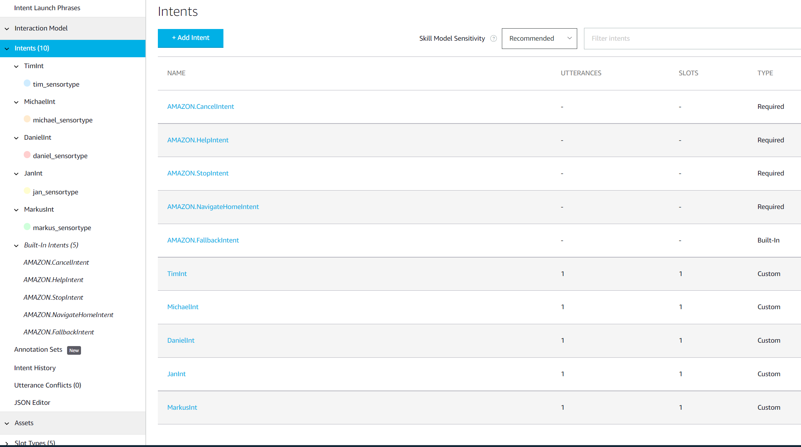
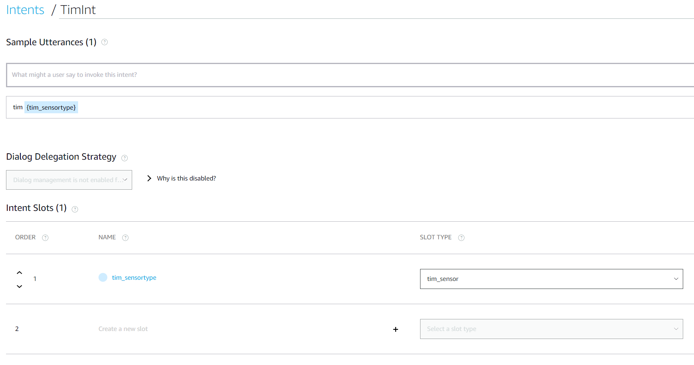
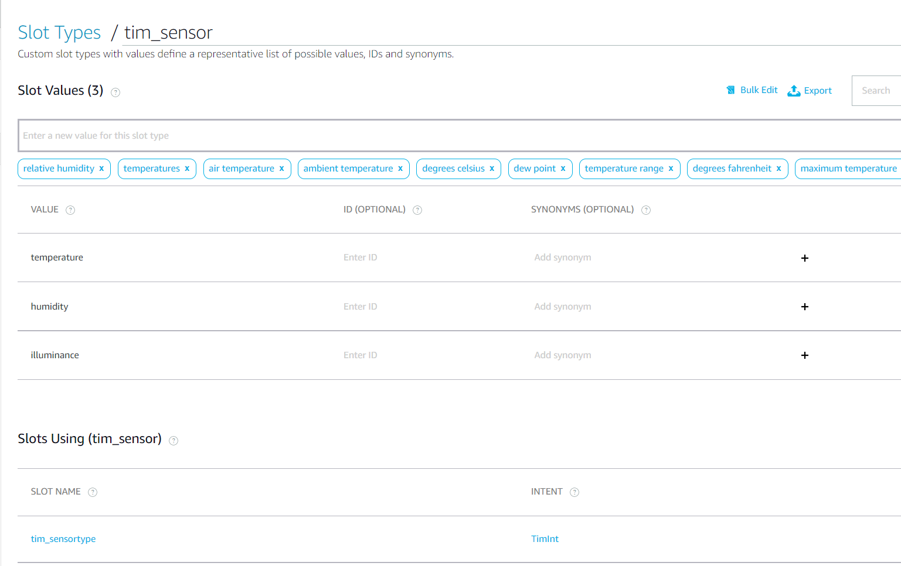
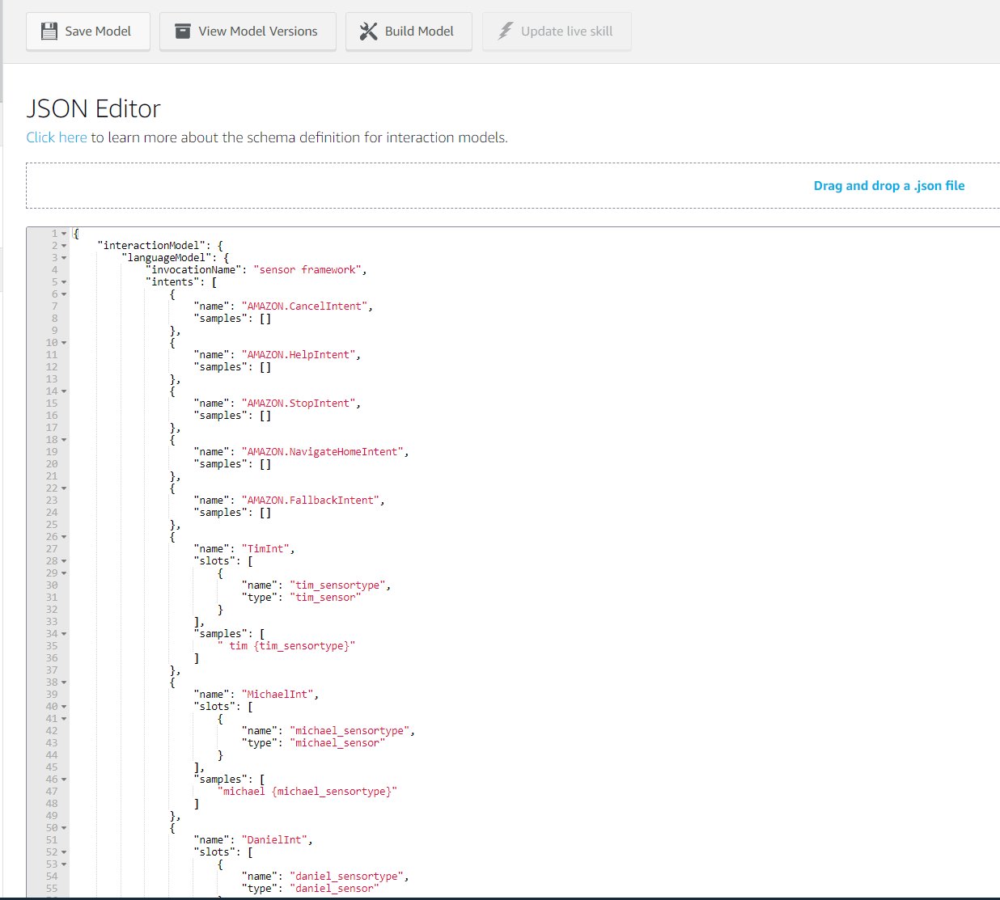
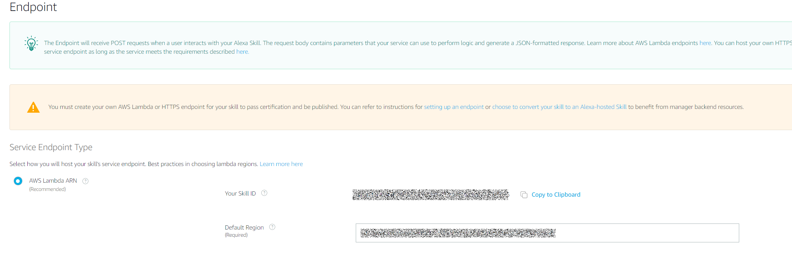

# Alexa Skill

 In this section it's shown how to set up an Alexa Skill to address the sensor values which are saved in `timestream`.

## Requierments

You need an Amazon account to create a skill on the Alexa Developer page.

[Amazon Alexa Developer](https://developer.amazon.com/de-DE/alexa/alexa-skills-kit)

## Tutorial

 When you create a new skill, you have to select a few points for the basic configuration.

 The name is freely selectable and only serves to enable the skill to be found and assigned.
 The next step is to select the desired language. This is very important because you have to decide how to call up the skill.
 In our setup, we have selected the options **Custom** and **Provision your own** for the next two items, as we do not use a prefabricated tool from Amazon, but control everything via our own Lambda function

 For the development of your Alexa skill, there is a graphical user interface that reduces programming and manual intervention in the code, to a minimum. The editing view of the Alexa development console is divided into five areas:

 1. Build (development)
 2. Test
 3. Distribution (Publication)
 4. Certification
 5. Analytics (analysis).

 The first step in the skill is to set the **invocation**. There are a few things to consider here. The phrase must consist of at least two words. It should also be a fairly unique phrase to avoid misunderstandings.
 From now on, you control your skill via the **intents**. After you have called up the skill with the help of the **invocation**, you call up the individual functions practically with the **intents**. With Intents, you define actions that your Alexa Skill will perform as soon as a user uses a speech pattern you specify.

 There are some essential intents that are required by Amazon. For example, the **StopIntent** to stop the skill.

 Define sample phrases with which users can call up the new intent. Enter the desired phrase in the text field provided and click on the plus sign (+).
 You can also use slots in these sample utterances. With these, you can define certain variables in the desired sentence structure.
 You simply give the slot a name and assign it a slot type.
 In the slot type you can then define possible inputs

 When you have finished, you can build the model.
 If everything went right in the build process, you can look at the finished interaction model of your skill in the JSON editor.
 Our JSON document contains the intents of our Alexa skill as well as the sample utterances assigned to the intents (if available). It thus includes all interaction options that are available on the user side.

 The last thing to do is to connect the skill with the lambda function.

 For this, you must enter the AWS ARN of the lambda function and the skill ID is also required for the lambda function in order to define it as a trigger event.
