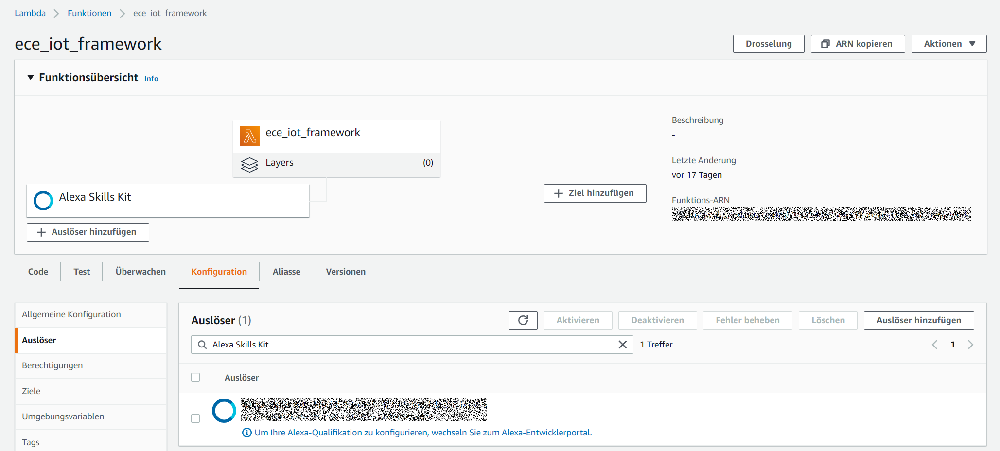

# Lambda function for Alexa Skill

In this part some basic part of the Lambda function for our Alexa Skill explained.
The Lambda function and the Alexa Skill communicate via the exchange of JSON files. The JSON files must always have a correct format, otherwise an error will occur.
Our function was written in Python. Node.js is also supported.

## Conection to the Lambda Function

First you have to select the Alexa Skill as a trigger event. To do this, you must enter the **Skill-ID**



## Lambda Handler

```python
	def lambda_handler(event, context):
		print("event.session.application.applicationId=" +
			  event['session']['application']['applicationId'])
		print("event:" + json.dumps(event))

		if event['session']['new']:
			on_session_started({'requestId': event['request']['requestId']},
							   event['session'])

		if event['request']['type'] == "LaunchRequest":
			return on_launch(event['request'], event['session'])
		elif event['request']['type'] == "IntentRequest":
			return on_intent(event['request'], event['session'])
		elif event['request']['type'] == "SessionEndedRequest":
			return on_session_ended(event['request'], event['session'])
```
This the main part of the Lambda-function. Route the incoming request based on type (LaunchRequest, IntentRequest, etc).
The JSON body of the request is provided in the event parameter.

## Intent Connection Handler
```python
	def on_intent(intent_request, session):
		print("on_intent requestId=" + intent_request['requestId'] +
			  ", sessionId=" + session['sessionId'])

		intent = intent_request['intent']
		intent_name = intent_request['intent']['name']

		print("***********************intent section***************************")
		print(intent_name)
		if intent_name == "TimInt":
			return handle_timintent_request(intent, session)
		elif intent_name == "MichaelInt":
			return handle_michaelintent_request(intent, session)
		elif intent_name == "DanielInt":
			return handle_danielintent_request(intent, session)
		elif intent_name == "JanInt":
			return handle_janintent_request(intent, session)
		elif intent_name == "MarkusInt":
			return handle_markusintent_request(intent, session)
		elif intent_name == "AMAZON.HelpIntent":
			return handle_get_help_request(intent, session)
		elif intent_name == "AMAZON.StopIntent":
			return handle_finish_session_request(intent, session)
		elif intent_name == "AMAZON.CancelIntent":
			return handle_finish_session_request(intent, session)
		else:
			raise ValueError("Invalid intent")
```
Called when the user specifies an intent for this skill.
So if Alexa Skill was able to match your voice command to an intent, this will be passed with the JSON file.
Each intent is then assigned its own function.
In this way, you can customise each intent individually.

## Custom Intent Handler

```python
	def handle_timintent_request(intent, session):
		should_end_session = False
		user_gave_up = intent['name']
		reprompt_text = "Don't you want to know who you really are, just ask {}".format(SKILL_NAME)

		sensor_result = sensor((intent['slots']['tim_sensortype']['value']), ("esp32_tim"), ("Lab 124"))
		sensor_result_unit = sensor_unit((intent['slots']['tim_sensortype']['value']), ("esp32_tim"), ("Lab 124"))
		speech_output=("The result of the sensor query is {:0.2f} {} in Lab 124".format(sensor_result, sensor_result_unit))
		print(speech_output)
		return build_response(
				{},
				build_speechlet_response(
					SKILL_NAME, speech_output, reprompt_text, should_end_session
				))
```

This is a custom skill handler. It is only called when the `TimIntent` is called.
In our project, we used the slot to pass the respective sensor type, which is read out of the JSON file.
To get the sensor value, another function is called to read the data from Timestream.
After that, everything is passed as a response so that Alexa can read it out.

## Timestream Query Function

```python
	def sensor(type, device, room):
    timestream = boto3.client('timestream-query')
    location = room
    database_name = "measurement_fleet"
    table_name = device
    sensor = type
    QUERY = \
    "SELECT * " \
    "FROM " + database_name + "." + table_name +" " \
    "WHERE SensorType='"+sensor+"' and Location='"+location+"' " \
    "ORDER BY time DESC " \
    "LIMIT 1"
    response = timestream.query(QueryString=QUERY)
    result = float(response['Rows'][0]['Data'][3]['ScalarValue'])
    return result
```

This the function to get the measurement data from Timestream.
The Boto3 library from Amazon is used for this purpose.
You can simply make an SQL query and get the data you are looking for.
