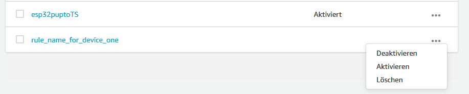

# Setting up AWS Timestream
---

Generally two parts are needed for the setup.

1. Timestream
2. IOT Core

## Quick Guide
---

Got to AWS Timestream, Databases and create a new database.

1. Sample database
2. Type a Name for the database.
3. Choose sample data sets: IoT
4. Multi-measure records
5. Create database

Open the database, go to table and create a new table.

1. Type a table name.
2. Choose a **Memory store retention** time.
3. Choose a **Magnetic store retention** time.
4. Optional: **Enable magnetic storage writes**.
5. Create table

Go to IoT Core, Handeln, Regeln and create a new one.

1. Type a name for the rule.
2. Type a SQL query. [SQL Guide](https://docs.aws.amazon.com/iot/latest/developerguide/iot-sql-reference.html?icmpid=docs_iot_console)
3. Add an action.
    4. Choose database and table.
    5. Add the dimensions.
    6. Create or add a Role.
        7. Create Rule.
8. Activate the rule.

## Timestream
---

This is the description on how to set up AWS Timestream.

### Database

One database is needed for every fleet.

- [ ] Database
- [ ] Table
- [ ] Rule

For example: *If you want to measure with 3 microcontrolers indoor and with 5 outdoor without any connection between indoor and outdoor, it is recommended to create two databases.*

Go to Amazone Timestream:


Select database and klick an create database to start creating a new one.


Choose the database configuration as shown.


After clicking on create database you should see an message **Succcesfully created database...**, if not an error accured and you have to recreate it.


The database is now created with one Table named **IoTMulti**. This Table is not needed for our setup.

### Table
For each device a new table is needed.

- [x] Database
- [ ] Table
- [ ] Rule


After clicking on the previous created database, go to the tap Tables und klick on Create table.


Type a Name for your Table and choose a time for the memory and the magnetic store.


Click on Create table. Optional: Enable magnetic storage writes.


After klicking on create table you should see a message **Succcesfully created table...**, if not an error accured and you have to recreate it.


## IOT Core
---

Description on how to setup the IoT Core for your devices.
The database and table to which the data should be sent must exist. *If not check Chapter Timestream*

- [x] Database
- [x] Table
- [ ] Rule

### Create a Rule

Go to IoT Core.


Select handle, rule and click create.


Give a name to the rule and add a query statement.
[SQL Guide](https://docs.aws.amazon.com/iot/latest/developerguide/iot-sql-reference.html?icmpid=docs_iot_console)

``` SELECT value FROM 'topic/subtopic_for_device_one/#' ```


### Add an Action

This tell AWS where the data should be send to.


Scroll down, select **Write a message to timestream table** and click on configure action.


Select the database and the table. Add the **Dimensions** acoording to the sheme:

 | Dimensionsname | Dimension value |
 | :--- | :--- |
 | ID | ${MAC_ADRESS} |
 | Name | ${DEVICE_NAME} |
 | Sensor Type | ${SENSOR_TYPE} |
 | SensorID | ${UNIQUE_SENSOR_ID} |
 | Value | ${VALUE} |
 | Unit | ${UNIT} |
 | MeasurementTime | ${TIME} |


Add or create a Role.


### Add a Role

Give the role a name.


Click on add action.


Click on create rule.


After clicking on create you should see a message **Rule succcesfully created**, if not an error accured and you have to recreate it.


Press on the three dots and select activate.


After clicking on activate you should see a message **Rule succcesfully activated**, if not an error accured and you have to recreate it.


- [x] Database
- [x] Table
- [x] Rule

Setup is done now.
